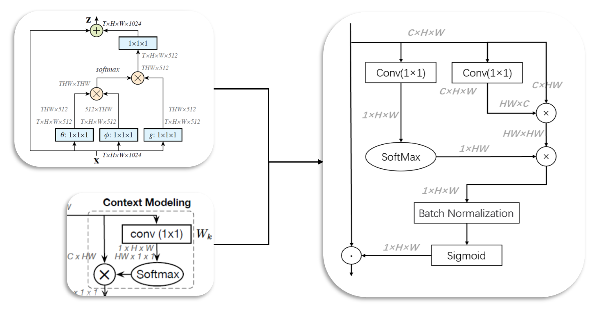
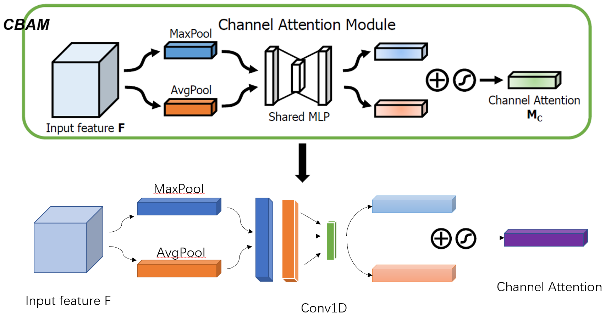

# MixSC
This project is for our course deep learning in the second semester of junior year at Nankai University, finished by Wei-Feng Yuan, Kun-Bin He and Xue-Rou Sun.

In this project, we use different methods to train CIFAR100, the baseline model is ResNet50, and we use different attentions, including A2, CBAM, Coordatt, GCNet, Non-local, SKNet, Triplet-Attrntion, besides we use two different structures which are Moblenext and MLP-Mixer.

What's more, we put  forward a new attention mixed with space attention and channel attention, which is called as MixSC. As for why not MixCS, it's because space attention before channel attention is proved to be more efficient.


## Space Attention

Inspired by Non-local and GCNet，we use non-local operation to get the space attention of input. As shown in the following picture.




## Channel Attention

We replace MLP with Conv1D of CBAM's channel attention. Experiments show that this can improve the accuracy. As shown in the following picture.





## Usage

Use the following instructions, you can get acc of all models we have trained:

```python
python main.py
```


## Experimental comparison

| No.  | Model                      | Param.(m) | GFLPs  | Acc.(%)  |
| ---- | -------------------------- | --------- | ------ | -------- |
| 1    | ResNet50                   | 23.71     | 1.31   | 61.2     |
| 2    | ResNet50+C-Att+MLP         | 23.71     | 1.31   | 61.9     |
| 3    | ResNet50+C-Att+Conv1D      | 23.71     | 1.31   | 62.5     |
| 4    | ResNet50+S-Att             | 43.86     | 2.38   | 62.2     |
| 5    | ResNet50+MixCS             | 43.86     | 2.38   | 63.4     |
| 6    | **ResNet50+MixSC**         | 43.86     | 2.38   | **65.8** |
| 7    | ResNet50+Non-local         | 64.01     | 3.46   | 63.2     |
| 8    | ResNet50+GCNet             | 33.81     | 1.32   | 61.6     |
| 9    | ResNet50+CBAM              | 24.23     | 1.31   | 60.3     |
| 10   | ResNet50+A2                | 43.85     | 2.38   | 47.6     |
| 11   | ResNet50+SKNet             | 25.46     | 10.76  | 37.8     |
| 12   | ResNet50+Coordatt          | 25.62     | 1.32   | 66.9     |
| 13   | ResNet50+Triplet-attention | 23.71     | 1.33   | 68.0     |
| 14   | MLP-Mixer                  | 4.38      | 38.76  | 31.7     |
| 15   | Mobilenext                 | 2.15      | 0.0062 | 36.8     |


## File directory

- hyperparameters: we use unified hyperparameters to test the model

- models: the code of models
- pth: trained model by unified hyperparameters
- notebook: the papers we read
- interface.py: encapsulated functions, such as train, load_data and so on
- main.py: get acc of all models


## Pay attention

Because 'pth' folder is too large, we aren't able to upload it, you can get it from the link of [Baidu Cloud](https://pan.baidu.com/s/1p2PsJAh5fcysemELgxp-mg). (Password is b5i0) 

We are new to the field of deep learning, maybe something above is wrong, you can contact me by email.
